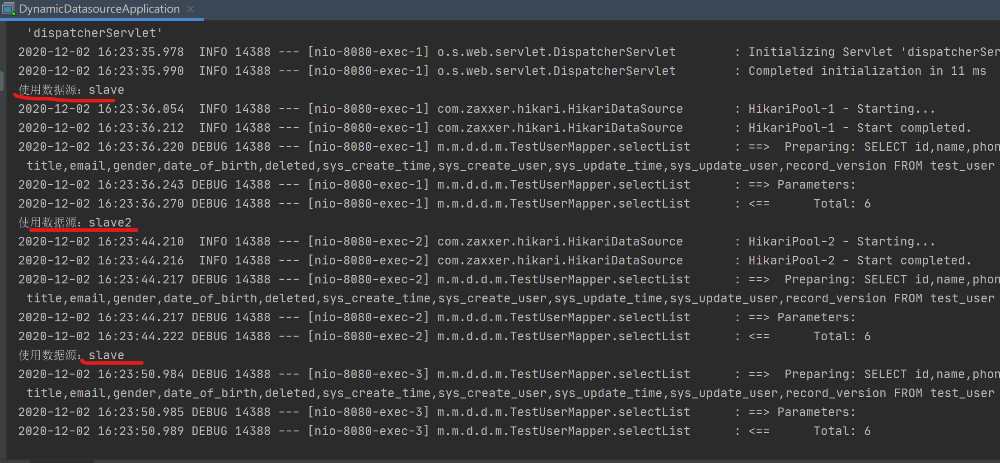
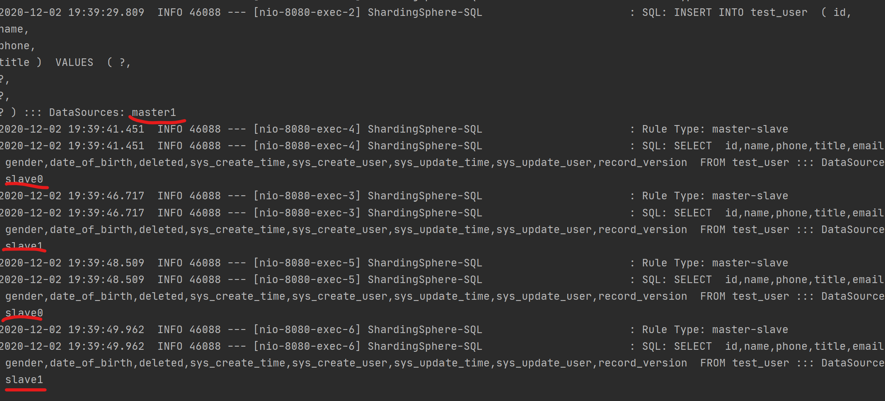

1. （必做）按自己设计的表结构，插入100万订单模拟数据，测试不同方式的插入效率。

   实现在：`JDBCDemo.java`，单条插入耗时：200秒，批量插入耗时：10秒 。

2. （必做）读写分离-动态切换数据源版本1.0

​       实现在`dynamic-datasource`工程中，实现了一主多从，从库轮询。

 

3. （必做）读写分离-数据库框架版本2.0

   实现在`spring-boot-sharding-read-write`工程中，使用`ShardingSphere`实现了主从读写分离。




参考资料：

- [SpringBoot 2.x ShardingSphere读写分离实战](https://juejin.cn/post/6844903857835737095#heading-0)

- [ShardingSphere > 使用手册 > Sharding-JDBC > 使用手册 > 读写分离](https://shardingsphere.apache.org/document/legacy/3.x/document/cn/manual/sharding-jdbc/usage/read-write-splitting/)
- [搞定SpringBoot多数据源(2)：动态数据源](https://juejin.cn/post/6844904050262016007)


在搭建`MySQL`主从时遇到的问题：

```
Slave_IO_Running: No
Slave_SQL_Running: No 
```

这两个一直为`No`，解决办法如下：

```
解决办法：
mysql>  stop slave;
mysql> set GLOBAL SQL_SLAVE_SKIP_COUNTER=1;
mysql>  start slave;
```

另外注意启动`MySQL`时的权限问题