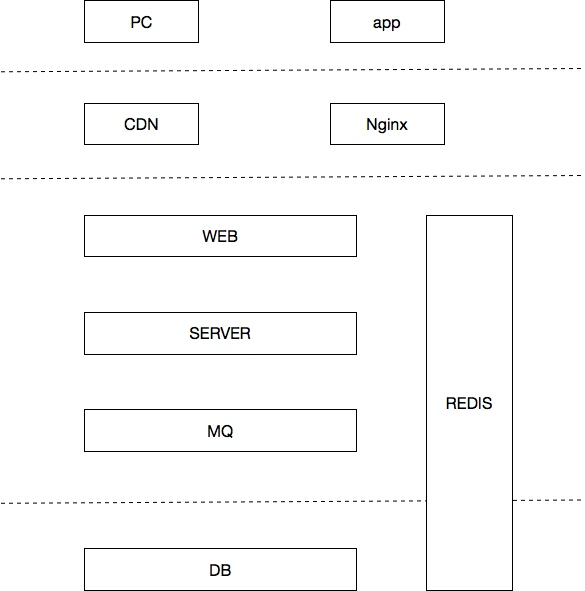
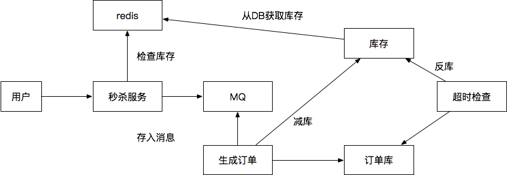

### 什么是秒杀 

一个时间点开始，大批用户对少量的商品开始抢购；往往是价格会低很多，或者供货很少，秒级时间内就能抢购完

### 为什么要有秒杀

引流和压测

#### 功能模块

* 商品展示
商品信息查询，商品图片展示

* 用户验证
用户信息验证，商品限制验证

* 订单
用户下单，创建订单，减库，订单更新

* 库存
库存同步，分布式系统中一致性保证

* 支付
订单支付，支付信息核对

### 架构设计

#### 流量预估
* 预约抢购

* UV统计

* 历史数据

* 宣传力度
* 产品定位

#### 限流

#####       前端限流

* 验证码

* 回答问题

* 随机访问到服务器

#####      服务端限流

* Nginx限流

* 容器
tomcat(设置并发数)，jetty

* 业务限流
  限流算法：令牌桶，漏桶

#### 服务稳定性

* 集群部署

* 备用节点预留

* 服务降级

* 模块划分

#### 服务优化
* 传输协议
http,tcp;nio,netty
* 传输序列化
kryo，hession，protobuf
* 编码优化
方法调用，对象使用，方法内逃逸
* 缓存使用
redis/mc，本地cache
* 并发控制
分布式锁，Java多线程
* JVM调优
参数调优，回收器设置等等

#### 框架架构

#### 程序逻辑

* 用户请求到秒杀服务
* 秒杀服务去redis检查库存并进行redis扣减decrby 
* redis库存是由库存表全量同步过来的
* 有库存存入MQ
* 生成订单的服务去MQ消费
* 生成订单到订单表
* 去DB中做真实减库
* 订单如果没有支付，有超时服务去订单表检查
* 如果超时反库
* 反库会同步到redis中去

