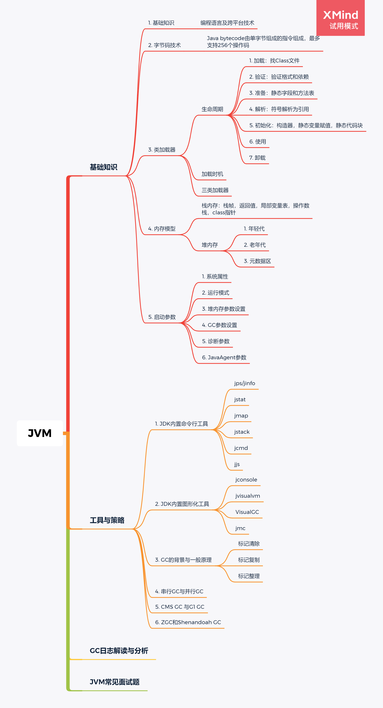
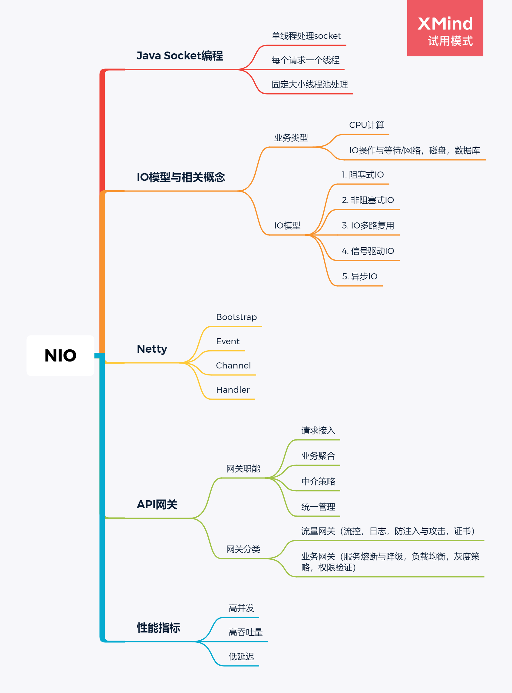
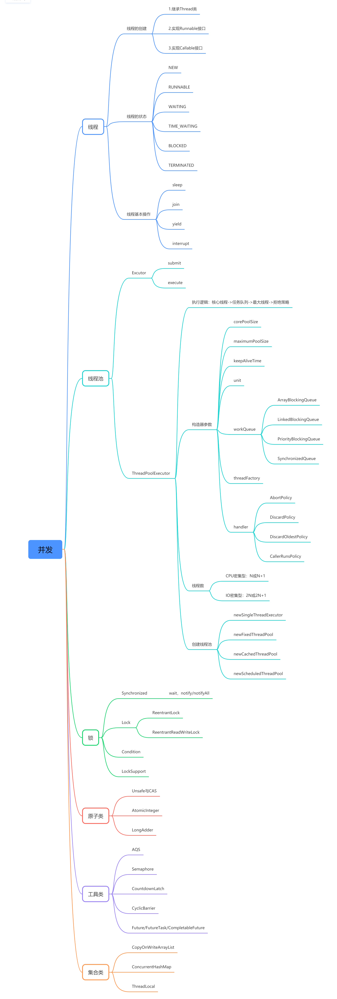
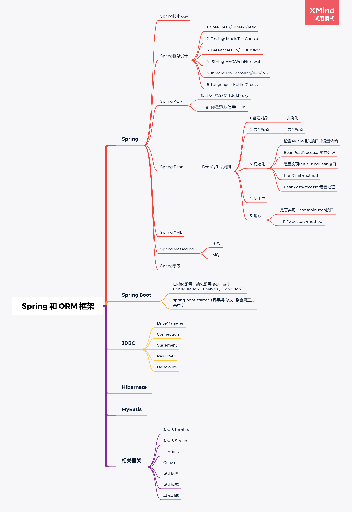
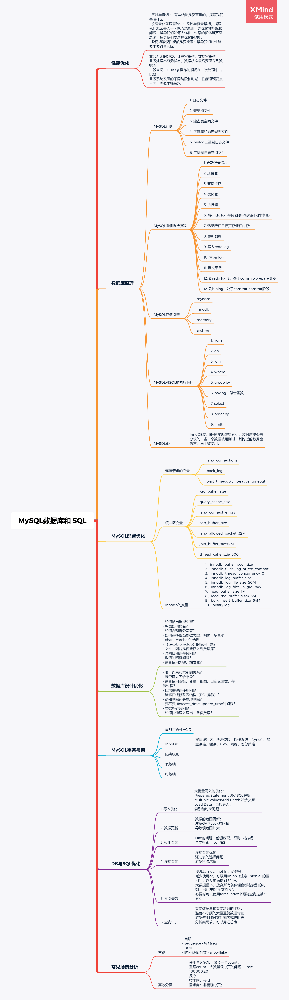
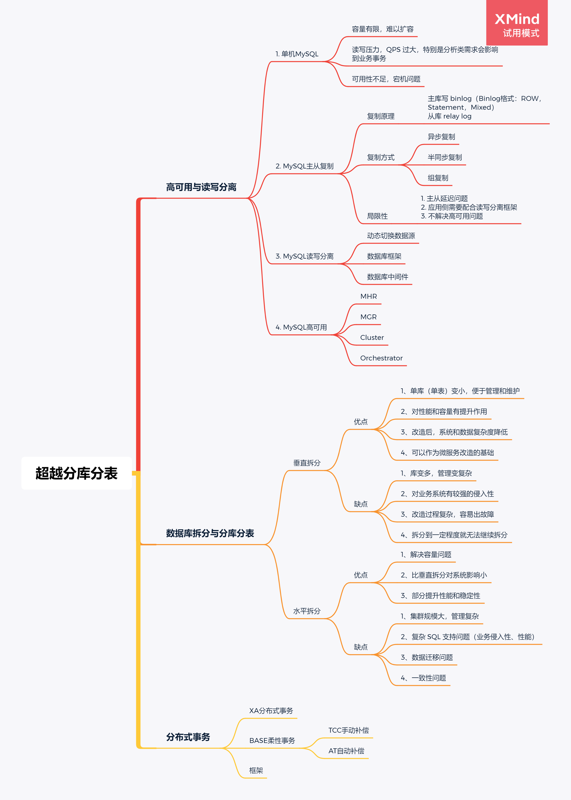
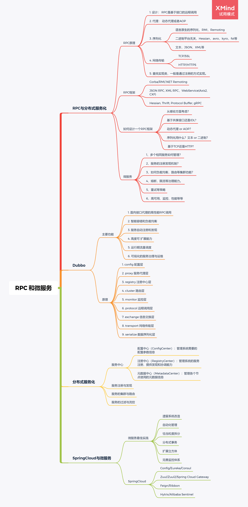
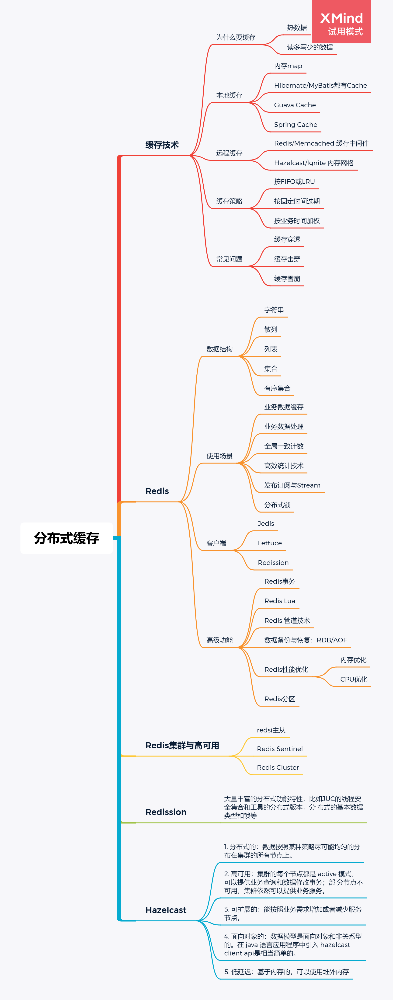
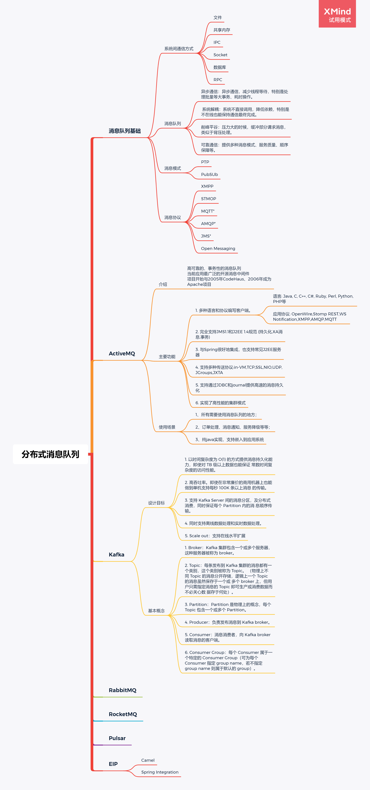

### 毕业作业

#### 1. `JVM`

`JVM`的主要知识是类加载器（生命周期，加载时机，如何加载类），内存模型（重点是堆内存的划分，各个参数的含义），`JDK`命令与图形化工具，各种`GC`的原理和对比（每种`GC`适用场景，年轻代和老年代的算法，吞吐量和延迟，停顿时间，各个`JDK`版本的默认`GC`）。

#### 2. `NIO`

`NIO`的重点是`IO`编程模型

- 阻塞式`IO`：服务端循环等待连接，有连接到来就去处理。此时，就不能处理其他的请求了，只能等待之前的处理完成。
- 非阻塞式`IO`：当请求到达服务端便立即返回；客户端需要不断轮询数据是否准备好。
- `IO`多路复用：在非阻塞式`IO`上进行改进，在一个线程中同时监听多个`socket`，当某个`socket`数据准备好之后，就通知用户进程。轮询的实现有`select/poll`，`epoll`。
- 信号驱动`IO`：信号驱动 `IO` 与 `BIO` 和 `NIO` 最大的区别就在于，在 `IO` 执行的数据准备阶段 ，不会阻塞用户进程。当数据准备好之后，发送一个信号给用户进程。
- 异步`IO`：异步 `IO` 真正实现了 `IO` 全流程的非阻塞。用户进程发出系统调用后立即返回，内核等待数据准备完成，然后将 数据拷贝到用户进程缓冲区，然后发送信号告诉用户进程 `IO` 操作执行完毕`。

一次IO操作在服务端而言有两个阶段：等待数据和将数据从内核复制到用户空间。

#### 3. 并发编程

并发相关的知识可太多了。包括不限于：线程的状态及通信，线程同步，线程池的处理方式，拒绝策略，锁的分类及原理（读写锁，悲观锁，乐观锁，自旋锁，互斥锁），常用工具类（`CountDownLatch`，`CyclicBarrier`，`Semaphore`），`AQS（抽象队列同步器）`，`ThreadLocal`。列出的重点是：`Java`多线程，线程安全，线程池原理与应用，到底什么是锁，并发原子类，并发工具类，并发编程经验，并发编程面试题。

#### 4. `Spring` 和 `ORM `框架

这一模块涉及到多个框架（`Spring，Spring Boot，Hibernate，MyBatis，Guava，Lambda，Stream`），内容很多。老师主要梳理了一遍有哪些知识需要去看，需要重点关注，后续自己还得多多加强学习。列出的重点内容有：`Spring`框架设计，`Spring Bean`核心原理，`Spring XML`配置原理，`Spring Boot`核心原理，`Spring Boot Starter`详解，`JDBC`与数据库连接池，`ORM`框架，`JPA`，`Lambda`，`Stream`，设计原则和模式，单元测试。

#### 5. `MySQL` 数据库和 `SQL`

`MySQL`数据库的知识点也好多啊，之前一直在看事务，根据老师将的内容，然后在小组做了一次从单体事务到分布式事务的分享。后面还在准备看其他的：日志，事务和锁的具体实现原理，还需要进一步加深，课后继续阅读老师提供的书单。列出的重点类容是`MySQL`配置优化，数据库设计优化，`MySQL`事务与锁，`DB`与`SQL`优化，场景场景分析。

#### 6. 分库分表

这一章完全超出自己理解的范围，之前没有接触过这块，理解起来也有点困难。初步的话，能够接收多少是多少。列出来的重点是：`MySQL`主从复制，`MySQL`读写分离，`MySQL`高可用，为什么要做数据拆分，数据库垂直拆分，数据库水平拆分，相关的框架和中间件，分布式事务，`XA`分布式事务，`BASE`柔性事务，`TCC/AT`以及相关框架。

### 7. `RPC` 和微服务

这一个模块，自己能够听到一部分吧，知道了为啥会有微服务。明白从`RPC`到微服务的过程后，更能理解`Dubbo`和`Spring Cloud`这些微服务框架要做什么事情。他们的核心功能是为了实现远程调用，但是为了实现这个核心功能还需要很多其他非功能性的需求，比如流控，幂等，重试，监控等等。

#### 8. 分布式缓存

缓存技术是将高频率访问的数据放到内存，以减少对数据库的操作，提升系统性能。最简单的实现是用map放在内存中。但是还有还多其他非功能性的需求，比如内存有限，数据需要及时清理，而实现这个功能又需要考虑哪些数据要清理，数据何时清理等等问题。还有，一个缓存数据节点不一定可靠，需要主从，哨兵，集群等等机制。

#### 9. 分布式消息队列

从未使用过消息队列的我，听着比较懵😵。

消息队列可以解决系统间的交互，相比于其他方式，它更加高效，可以异步处理数据，与其他系统更加解耦，还能顶住压力。在满足`MQ`的功能后，消息中间件还可以扩展其他功能。比如`Kafka`的离线与实时处理数据。

### 总结

对于毕业半年的我来说，通过参加这次训练营，极大的拓展了我的知识广度，好多技术我都没有真正的使用过。特别是在数据库的高可用，超越分库分表，微服务，缓存的高可用，`MQ`几个模块（好像我把所有模块都列了一遍......）深入的地方都不太明白。不过，幸运的是，遇到了秦老师，秦老师讲课很有逻辑，条例清晰，总是会讲到为什么有这个技术，这个技术又是如何演进的。特别是缓存，`RPC`和微服务。比如`RPC`的核心是想要实现：调用本地方法一样调用远程方法，那这就需要考虑本地调用和远程服务的实现，代理存根个服务存根，序列化和反序列化，以及网络通信。这些就实现了`RPC`的核心功能，但是还有很多其他重试幂等，路由，流控，监控等等非功能性需求要考虑，这就有了现在的微服务框架。通过老师这样的讲述，我觉得理解起来就很容易，点赞👍（厉害的人总是能将复杂的问题简单化）。所以明白了技术的来龙去脉，就能更好的理解当前热门技术的核心思想。

真的很幸运，一毕业就遇到秦老师这样的好老师，能把技术讲的清清楚楚，明明白白。训练营的结束才是我的开始，每个模块都还需要花时间去慢慢消化。

最后，能够坚持下来，就能超越百分之八九十的人，越到后面，看视频的少了，交作业的越少了。但是自己坚持下来了，看完了所有的视频，完成了必做的作业，给自己点个赞，哈哈哈哈哈哈哈哈哈哈~~~

最最后，感谢秦老师愿意带领我们这帮小弟，感谢猫大人带着我们搞开源，感谢泽哥的有问必答，感谢崔崔老师为我们忙前忙后，感谢训练营的助教老师和其他同学们，`Java`0期，永不过期！！！

